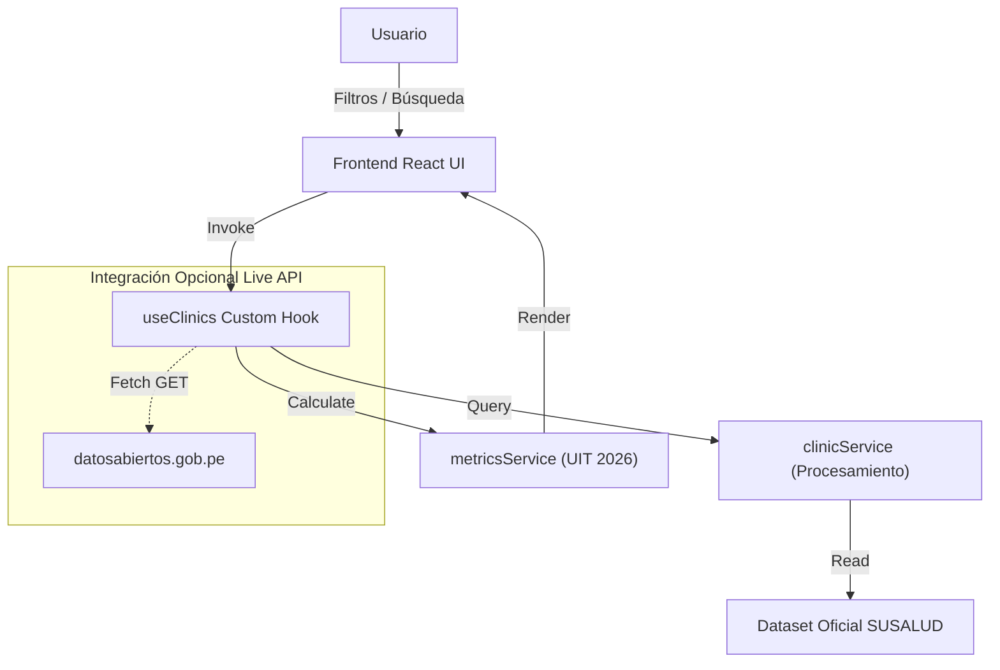

# Observatorio SUSALUD Digital - Sistema de Monitoreo de Clínicas e IPRESS

Plataforma web interactiva para la supervisión de la atención en salud, registro de reclamos, sanciones y negligencias médicas sancionadas por la **Superintendencia Nacional de Salud (SUSALUD)** y el registro **RENIPRESS**.

---

## 📋 Índice

- [Visión General](#-visión-general)
- [Arquitectura de Dominios](#-arquitectura-de-dominios)
- [Documentación Técnica (docs/)](#-documentación-técnica-docs)
- [Instalación y Uso](#-instalación-y-uso)
- [Diagramas de Arquitectura](#-diagramas-de-arquitectura)
- [Licencia](#-licencia)

---

## 👁️ Visión General

El **Observatorio SUSALUD Digital** ofrece un dashboard interactivo de analítica de datos abiertos para la ciudadanía, investigadores y fiscalizadores.

### Características Clave:
- 📊 **Métricas Consolidadas**: Total de reclamos, negligencias confirmadas, sanciones y cálculo acumulado en **UIT (S/ 5,350 para 2026)**.
- 🏥 **Ranking e Historial por IPRESS**: Visualización gráfica y detallada del historial de sanciones de clínicas a nivel nacional.
- 🗺️ **Distribución Departamental e Infracciones**: Desglose por regiones y clasificación del tipo de infracción cometida.
- 🗓️ **Filtros Temporales Multidimensionales**: Filtrado en tiempo real por **Año (2024, 2025, 2026)**, **Trimestre (Q1, Q2, Q3, Q4)** y **Mes**.
- 🛠️ **Consola de API de Datos Abiertos**: Herramienta de pruebas de conectividad y latencia contra los endpoints de `datosabiertos.gob.pe`.

---

## 📐 Arquitectura de Dominios

El proyecto sigue una **Arquitectura Guiada por Dominios en el Frontend (Domain-Driven Frontend Architecture)**:

```
susalud-monitor-webapp/
├── docs/                           # Documentación técnica y de arquitectura
│   ├── architecture.md             # Diseño de software y diagramas
│   ├── domain-model.md             # Modelo de dominio y reglas de cálculo
│   ├── visual-design.md            # Tokens visuales y sistema de diseño
│   └── api-guide.md                # Integración API y resiliencia
├── src/
│   ├── domains/                    # Módulos aislados por dominio
│   │   ├── clinics/                # Dominio de Clínicas / IPRESS
│   │   ├── metrics/                # Dominio de Métricas Nacionales
│   │   ├── filters/                # Dominio de Filtros Temporales
│   │   └── api-console/            # Dominio de Consola de Monitoreo API
│   ├── shared/                     # Componentes y estilos compartidos
│   │   ├── components/
│   │   └── styles/
│   ├── App.jsx                     # Orquestador Principal
│   └── main.jsx
```

---

## 📚 Documentación Técnica (docs/)

Para profundizar en el diseño del sistema, consulta los siguientes manuales en la carpeta `docs/`:

1. 🏛️ [Arquitectura de Software](file:///c:/labs/susalud/docs/architecture.md)
2. 🏬 [Modelo de Dominio y Reglas de Negocio](file:///c:/labs/susalud/docs/domain-model.md)
3. 🎨 [Sistema de Diseño Visual y UX](file:///c:/labs/susalud/docs/visual-design.md)
4. 🌐 [Guía de Integración API y Resiliencia](file:///c:/labs/susalud/docs/api-guide.md)

---

## 📊 Diagramas de Arquitectura

### Diagrama de Flujo de Datos



---

## 🚀 Instalación y Uso

### Requisitos Previos
- **Node.js**: v18.x o superior
- **npm**: v9.x o superior

### Pasos de Ejecución

1. **Instalar dependencias**:
   ```bash
   npm install
   ```

2. **Iniciar servidor de desarrollo**:
   ```bash
   npm run dev
   ```

3. **Construir para producción**:
   ```bash
   npm run build
   ```

---

## 📜 Licencia

Desarrollado como iniciativa de código abierto para el **Observatorio de Salud y Datos Abiertos del Perú** (2026).
