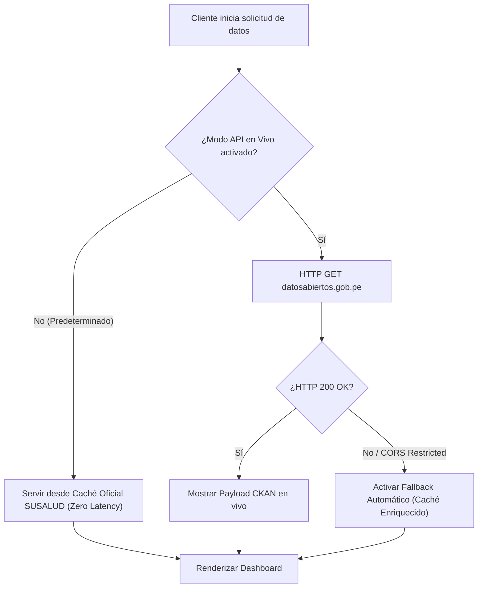

# Guía de API y Resiliencia - Observatorio SUSALUD Digital

Este documento describe la integración con la API RESTful de la plataforma de Datos Abiertos del Gobierno Peruano (CKAN) y la estrategia de resiliencia y fallback.

---

## 🌐 Endpoints de Datos Abiertos

### 1. CKAN Package Search API
- **URL Base**: `https://www.datosabiertos.gob.pe/api/3/action/package_search`
- **Parámetro**: `q=susalud`
- **Método**: `GET`
- **Respuesta esperada**: JSON con la lista de datasets de la entidad SUSALUD.

---

## 🛡️ Estrategia de Fallback y Resiliencia

---

## ⏱️ Diagnóstico de Latencia y Consola API

La Consola de API (`ApiConnectionConsole`) incluye una herramienta de prueba de conectividad y latencia en tiempo real (`testSusaludEndpoint`) que mide:
- Código de estado HTTP (200, 403, 404, etc.)
- Latencia de red en milisegundos (`latencyMs`)
- Detección de restricciones de CORS o bloqueo por Firewalls corporativos.
