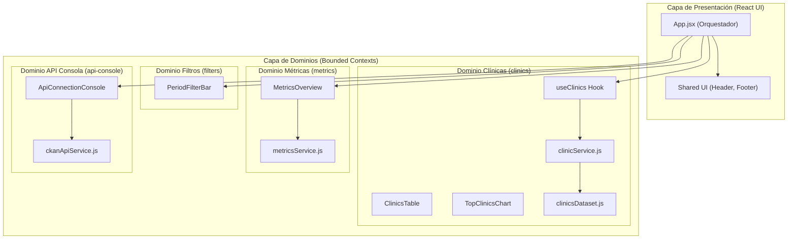
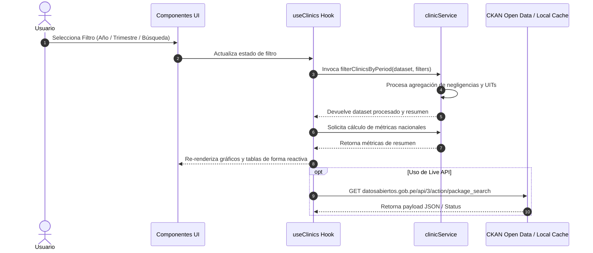

# Arquitectura de Software - Observatorio SUSALUD Digital

Este documento describe la arquitectura técnica, diseño por dominios, flujo de datos y patrones de mantenibilidad del **Observatorio SUSALUD Digital**.

---

## 🏛️ Visión General de la Arquitectura

El sistema implementa una **Arquitectura Guiada por Dominios en el Frontend (Domain-Driven Frontend Architecture)**. Cada módulo funcional se agrupa dentro de su propio contexto delimitado (Bounded Context), desacoplando la lógica de negocio, los servicios de datos y los componentes de la interfaz de usuario.



---

## 🧩 Estructura Modular por Dominios

```
src/
├── domains/
│   ├── clinics/                   # Dominio de Clínicas e IPRESS
│   │   ├── components/            # Componentes visuales de clínicas
│   │   │   ├── ClinicDetailModal.jsx
│   │   │   ├── ClinicsTable.jsx
│   │   │   ├── TopClinicsChart.jsx
│   │   │   ├── DepartmentDistribution.jsx
│   │   │   └── InfractionTypeChart.jsx
│   │   ├── hooks/                 # Custom Hooks del dominio
│   │   │   └── useClinics.js
│   │   ├── services/              # Lógica de negocio y filtrado
│   │   │   └── clinicService.js
│   │   └── data/                  # Dataset oficial y mockdata
│   │       └── clinicsDataset.js
│   │
│   ├── metrics/                   # Dominio de Métricas Nacionales
│   │   ├── components/
│   │   │   └── MetricsOverview.jsx
│   │   └── services/
│   │       └── metricsService.js
│   │
│   ├── filters/                   # Dominio de Filtros Temporales
│   │   └── components/
│   │       └── PeriodFilterBar.jsx
│   │
│   └── api-console/               # Dominio de Monitoreo e Integración API
│       ├── components/
│       │   └── ApiConnectionConsole.jsx
│       └── services/
│           └── ckanApiService.js
│
├── shared/                        # Recursos Reutilizables Compartidos
│   ├── components/
│   │   ├── Header.jsx
│   │   └── Footer.jsx
│   └── styles/
│       └── index.css
│
├── App.jsx                        # Orquestador del Dashboard
└── main.jsx                       # Punto de entrada de React
```

---

## 🔄 Flujo de Datos y Reactividad



---

## 🛡️ Principios Arquitectónicos Aplicados

1. **Single Responsibility Principle (SRP)**:
   - Los componentes de UI solo renderizan la vista y delegan la lógica de filtrado y agregación a los servicios del dominio.
2. **Separation of Concerns (SoC)**:
   - El estado reactivo de las clínicas se aísla dentro del custom hook `useClinics`.
3. **Resiliencia y Fallback Activo**:
   - Si la API pública de datos abiertos de SUSALUD se encuentra fuera de servicio o bloqueada por CORS, el sistema conmuta suavemente al dataset optimizado en caché local manteniendo la operatividad continua.
4. **Design System basado en Tokens CSS**:
   - Todos los estilos se manejan centralizadamente mediante variables CSS para facilitar cambios de temas (Dark Mode / High Contrast).
