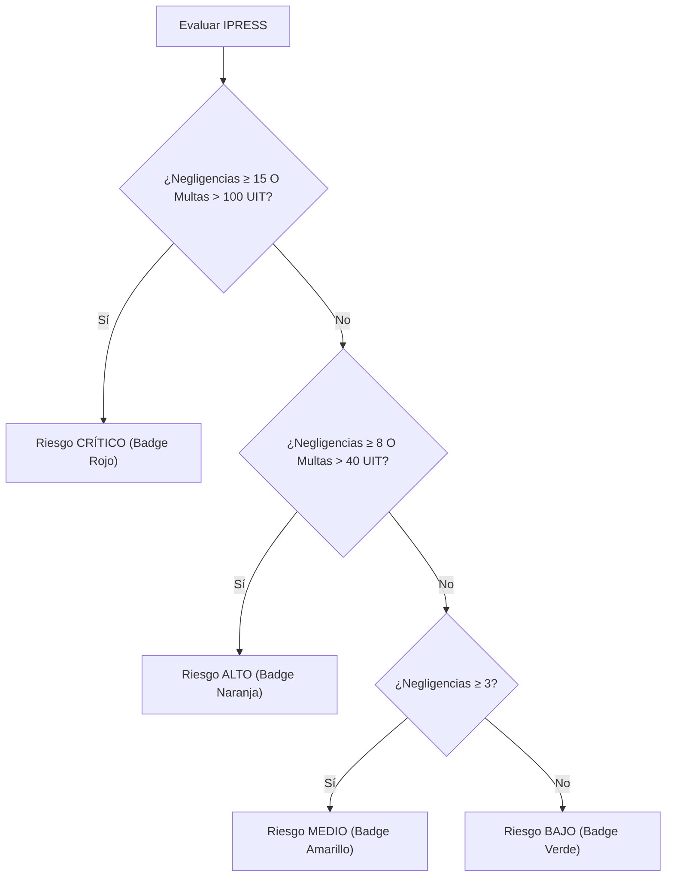

# Modelo de Dominio - Observatorio SUSALUD Digital

Este documento detalla las entidades de negocio, reglas de cálculo de sanciones y estructura de datos del **Observatorio SUSALUD Digital**.

---

## 🏬 Entidades Principales

### 1. Clínica / IPRESS (`Clinic`)
Representa una Institución Prestadora de Servicios de Salud supervisada por la Superintendencia Nacional de Salud (SUSALUD) y registrada en el **RENIPRESS**.

```typescript
interface Clinic {
  id: string;                       // Código Único RENIPRESS (ej. IPRESS-001)
  nombre: string;                   // Nombre comercial (ej. Clínica Delgado)
  razonSocial: string;              // Razón social legal
  categoria: string;                // Categoría IPRESS (III-1, II-2, etc.)
  departamento: string;             // Departamento del Perú
  distrito: string;                 // Distrito
  direccion: string;                // Dirección física
  nivelRiesgo: 'CRITICO' | 'ALTO' | 'MEDIO' | 'BAJO';
  negligenciasCount: number;        // Total negligencias en el periodo
  sancionesCount: number;           // Total sanciones firmes
  reclamosTotales: number;          // Total reclamos recibidos
  multasUIT: number;                // Multas acumuladas en UIT
  principalInfraccion: string;      // Tipo de infracción predominante
  historial: HistoryPeriod[];       // Historial desglosado por año/trimestre
}
```

### 2. Historial por Periodo (`HistoryPeriod`)
Desglose temporal de infracciones para análisis de tendencias.

```typescript
interface HistoryPeriod {
  anio: number;                     // Año (2024, 2025, 2026)
  trimestre: 'Q1' | 'Q2' | 'Q3' | 'Q4';
  mes: number;                      // Mes (1 a 12)
  negligencias: number;
  sanciones: number;
  reclamos: number;
  multasUIT: number;
}
```

### 3. Métricas Consolidadas Nacionales (`NationalMetrics`)
Resumen ejecutivo de supervisiones a nivel nacional.

```typescript
interface NationalMetrics {
  totalReclamosNacional: number;
  totalNegligenciasConfirmadas: number;
  totalSancionesImpuestas: number;
  multasTotalesUIT: number;
  uitValorSol: number;              // Valor oficial de la UIT 2026: S/ 5,350
  ipressSupervisadas: number;
  ultimaActualizacion: string;
}
```

---

## 📐 Reglas de Negocio y Cálculos

### 1. Valor de la UIT (Unidad Impositiva Tributaria)
- Para el año fiscal 2026, el valor de la UIT oficial es de **S/ 5,350.00**.
- El monto estimado en Soles se calcula dinámicamente mediante:
  $$\text{Monto en Soles} = \text{multasUIT} \times 5350$$

### 2. Clasificación de Niveles de Riesgo IPRESS



---

## 📊 Módulos de Datos Disponibles

El dataset contiene información filtrable por los siguientes ejes temporales:
- **Años**: 2024, 2025, 2026, Todos
- **Trimestres**: Q1, Q2, Q3, Q4, Todos
- **Meses**: 1 (Enero) a 12 (Diciembre), Todos
- **Filtro de búsqueda libre**: Código RENIPRESS, Nombre Comercial, Razón Social, Departamento o Distrito.
